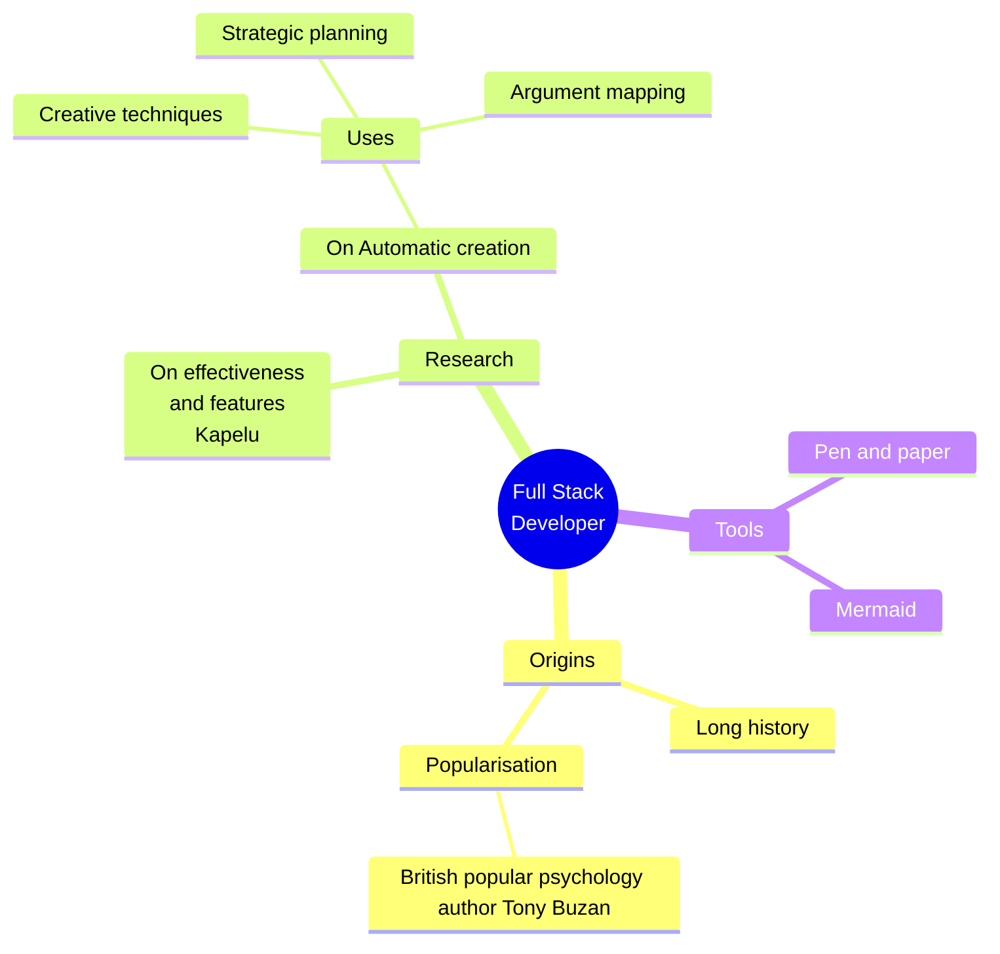

<article style={{borderRadius: '.5rem', padding: '2rem 1rem', backgroundColor: '#cccccc90'}}>

<h2 style={{textAlign:'center'}}>Barras de progreso</h2>

 

 

 

 

<h2 style={{textAlign:'center'}}>Gráficos usando mermaind</h2>




<h2 style={{textAlign:'center'}}>Logo SVG</h2>

## Logo svg

<p style={{textAlign:'center'}}>Logo de JavaScript en SVG</p>

<div style={{ maxWidth:'100px', display: 'block', margin: '0 auto', textAlign: 'center',}}>
<rect width='630' height='630' fill='%23f7df1e' /><path d='m423.2 492.19c12.69 20.72 29.2 35.95 58.4 35.95 24.53 0 40.2-12.26 40.2-29.2 0-20.3-16.1-27.49-43.1-39.3l-14.8-6.35c-42.72-18.2-71.1-41-71.1-89.2 0-44.4 33.83-78.2 86.7-78.2 37.64 0 64.7 13.1 84.2 47.4l-46.1 29.6c-10.15-18.2-21.1-25.37-38.1-25.37-17.34 0-28.33 11-28.33 25.37 0 17.76 11 24.95 36.4 35.95l14.8 6.34c50.3 21.57 78.7 43.56 78.7 93 0 53.3-41.87 82.5-98.1 82.5-54.98 0-90.5-26.2-107.88-60.54zm-209.13 5.13c9.3 16.5 17.76 30.45 38.1 30.45 19.45 0 31.72-7.61 31.72-37.2v-201.3h59.2v202.1c0 61.3-35.94 89.2-88.4 89.2-47.4 0-74.85-24.53-88.81-54.075z'/></svg>" />
</div>

```html
<svg xmlns="http://www.w3.org/2000/svg" viewBox="0 0 630 630">
  <rect width="630" height="630" fill="#f7df1e"/>
  <path d="m423.2 492.19c12.69 20.72 29.2 35.95 58.4 35.95 24.53 0 40.2-12.26 40.2-29.2 0-20.3-16.1-27.49-43.1-39.3l-14.8-6.35c-42.72-18.2-71.1-41-71.1-89.2 0-44.4 33.83-78.2 86.7-78.2 37.64 0 64.7 13.1 84.2 47.4l-46.1 29.6c-10.15-18.2-21.1-25.37-38.1-25.37-17.34 0-28.33 11-28.33 25.37 0 17.76 11 24.95 36.4 35.95l14.8 6.34c50.3 21.57 78.7 43.56 78.7 93 0 53.3-41.87 82.5-98.1 82.5-54.98 0-90.5-26.2-107.88-60.54zm-209.13 5.13c9.3 16.5 17.76 30.45 38.1 30.45 19.45 0 31.72-7.61 31.72-37.2v-201.3h59.2v202.1c0 61.3-35.94 89.2-88.4 89.2-47.4 0-74.85-24.53-88.81-54.075z"/>
</svg>
```

<p style={{textAlign:'center'}}>Logo de HTML5 en SVG</p>

<div style={{ maxWidth:'100px', display: 'block', margin: '0 auto', textAlign: 'center',}}>
  
    <path fill='%23e34f26' d='M41 460L0 0h451l-41 460-185 52' />
    <path fill='%23ef652a' d='M226 472l149-41 35-394H226' />
    <path fill='%23ecedee' d='M226 208h-75l-5-58h80V94H84l15 171h127zm0 147l-64-17-4-45h-56l7 89 117 32z'/>
    <path fill='%23fff' d='M226 265h69l-7 73-62 17v59l115-32 16-174H226zm0-171v56h136l5-56z'/>
  </svg>" />
</div>

```html
<svg xmlns="http://www.w3.org/2000/svg" viewBox="0 0 452 520">
  <path fill="#e34f26" d="M41 460L0 0h451l-41 460-185 52" />
  <path fill="#ef652a" d="M226 472l149-41 35-394H226" />
  <path fill="#ecedee" d="M226 208h-75l-5-58h80V94H84l15 171h127zm0 147l-64-17-4-45h-56l7 89 117 32z"/>
  <path fill="#fff" d="M226 265h69l-7 73-62 17v59l115-32 16-174H226zm0-171v56h136l5-56z"/>
</svg>
```

<p style={{textAlign:'center'}}>Logo de CSS3 en SVG</p>

<div style={{ maxWidth:'100px', display: 'block', margin: '0 auto', textAlign: 'center',}}>
  
    <path fill='%230c73b8' d='M41 460L0 0h451l-41 460-185 52'/>
    <path fill='%2330a9dc' d='M226 472l149-41 35-394H226'/>
    <path fill='%23ecedee' d='M226 208H94l5 57h127zm0-114H84l5 56h137zm0 261l-124-33 7 60 117 32z'/>
    <path fill='%23fff' d='M226 265h69l-7 73-62 17v59l115-32 26-288H226v56h80l-6 58h-74z'/>
  </svg>" />
</div>

```html
<svg xmlns="http://www.w3.org/2000/svg" viewBox="0 0 452 520">
  <path fill="#0c73b8" d="M41 460L0 0h451l-41 460-185 52"/>
  <path fill="#30a9dc" d="M226 472l149-41 35-394H226"/>
  <path fill="#ecedee" d="M226 208H94l5 57h127zm0-114H84l5 56h137zm0 261l-124-33 7 60 117 32z"/>
  <path fill="#fff" d="M226 265h69l-7 73-62 17v59l115-32 26-288H226v56h80l-6 58h-74z"/>
</svg>
```

</article>